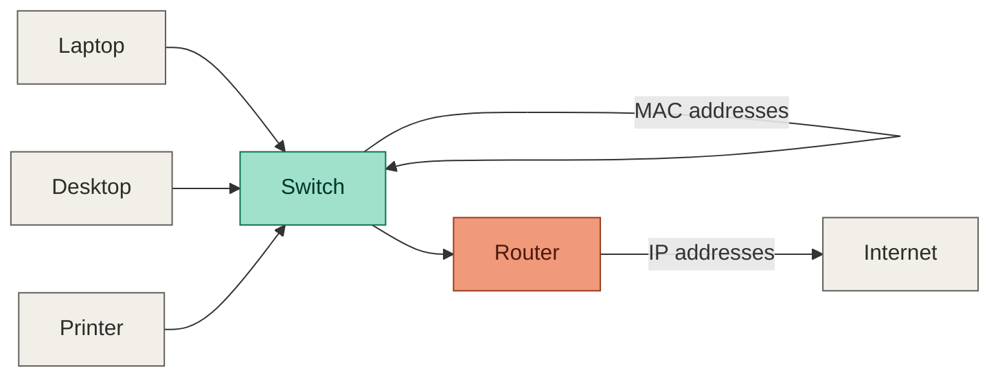

# Russ Munisteri, CISSP

---

> **For students:** This README is both my profile page and a working example of how to build your own. Everything below the next divider is annotated so you can see *why* each section exists, not just *what* it says. Copy the structure, then replace the content with your own.

---

## How this page works (read this first)

A GitHub profile README lives in a repository named exactly the same as your username. GitHub automatically displays it at the top of your profile.

What makes a good one:
- **A clear header** — who you are, in one line
- **A short "about" section** — what you're learning or working on, in plain language
- **One or two featured projects** — link to something you actually built, with a one-line description of what it does
- **Nothing you can't back up** — only link to work that's finished enough to show

That's it. You don't need badges, animations, or a long bio. Clarity beats decoration every time.

---

## About

I teach Networking I and Computer & Security Essentials (Microsoft Azure AI Fundamentals, AI-901) at MyComputerCareer. I build hands-on study resources and labs to help students prepare for industry certifications with real, practical skills — not just exam memorization.

---

## Example: A Finished Student-Style Project

This is what a completed, presentable project looks like once you're ready to feature it here.

**Russ' Portal**
A self-contained study site built for your classes with me. It covers all exam domains with a structured guide, a quick reference card, and interactive practice challenges.

**[View the live site →](https://ai-901.vercel.app/)**

When you reach this stage with your own project, this is the format to follow: one bolded title, one sentence describing what it does, one live link.

---

## Quick Check: Could You Explain This?

A good README often includes a small interactive piece to test understanding, the same way a good study guide does. Try this one.

A switch connects devices within the same local network and forwards traffic using MAC addresses. A router connects different networks together and forwards traffic using IP addresses.

<b>What's the difference between a switch and a router?</b>

 
If you're staying inside one network, you're switching. If you're crossing between networks, you're routing. The diagram above shows exactly that boundary.

<b>What does DHCP actually do?</b>

 
DHCP automatically assigns IP addresses, subnet masks, default gateways, and DNS servers to devices joining a network, so no one has to configure those settings by hand.

This `
` and `
` pattern is plain Markdown — no extra tools required. It's a simple way to make any README feel interactive.

---

## Certifications

`CISSP` `SSCP` `SecurityX` `CySA+` `Security+` `CCSK` `Cloud+` `Network+` `A+` `Project+` `Server+` `Cloud Essentials+` `Azure Fundamentals` `ITIL v3` `Lean Six Sigma White Belt`

